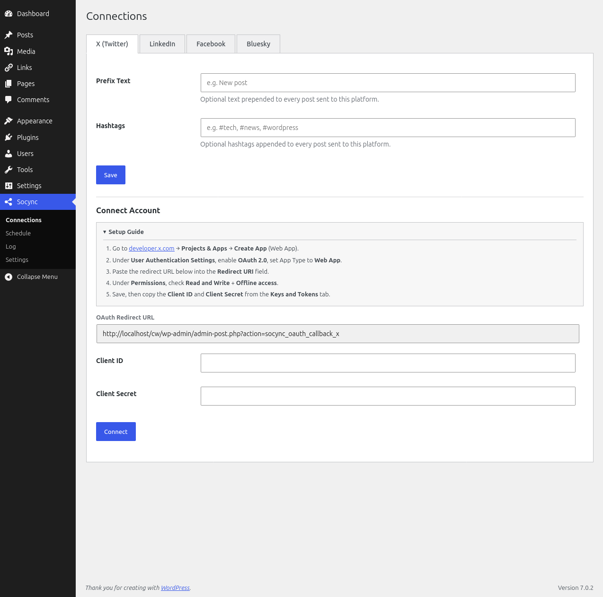
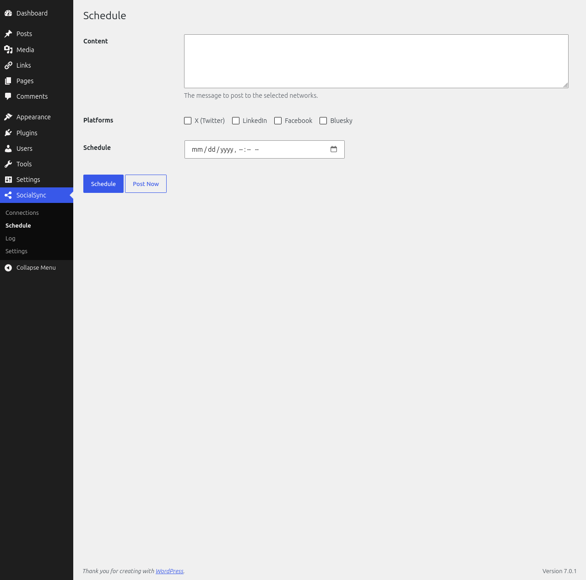
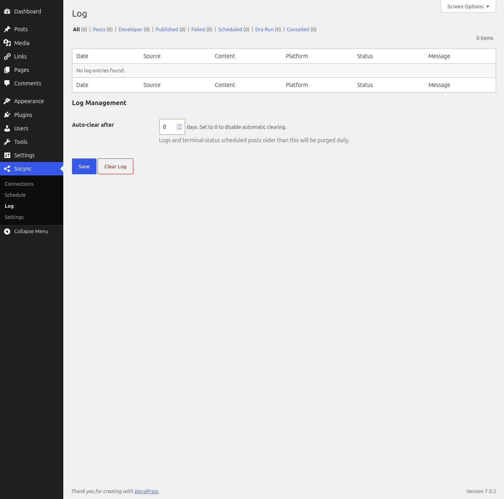

# Socync - Automatic social media posting and scheduling

A lightweight, stable, and maintainable WordPress plugin that automatically pushes published posts to X (Twitter), LinkedIn, Facebook and Bluesky.



## Features

- **Auto-Post on Publish**: Automatically push new WordPress posts to all connected platforms after a configurable delay (default 2 minutes)
- **Per-Platform Autoposting Toggle**: Choose which connected platforms receive auto-posts on the Settings page
- **Multi-Platform Support**: Post to X (Twitter), LinkedIn, Facebook, and Bluesky
- **Link Previews with Thumbnails**: LinkedIn and Bluesky posts include OG thumbnail images
- **Standalone Scheduled Posts**: Create posts directly from the Schedule page — no WP Post required
- **Flexible Scheduling**: Schedule standalone posts at a specific date and time
- **Custom Content**: Full control over post content for each platform (prefix, hashtags per platform)
- **Dry Run Mode**: Preview what would be posted without actually publishing
- **Uninstall Data Control**: Choose whether Socync data is deleted or preserved when the plugin is removed
- **Clean Admin Interface**: Tabbed settings page with unified Log view
- **Comprehensive Logging**: Track all posting attempts, errors, and developer-level API details
- **Multiple Auth Methods**: OAuth 2.0 (X, LinkedIn, Facebook), OAuth 1.0a legacy (X fallback), App Password (Bluesky)

## Requirements

- WordPress 5.0 or higher
- PHP 7.4 or higher
- API credentials for X (OAuth 2.0 PKCE or legacy OAuth 1.0a), LinkedIn (OAuth 2.0), Facebook (OAuth 2.0), Bluesky (App Password)

## Installation

1. Upload the `socync` folder to the `/wp-content/plugins/` directory
2. Activate the plugin through the 'Plugins' menu in WordPress
3. Navigate to Socync in the admin menu to configure your connections

## Configuration

### X (Twitter) — OAuth 2.0 PKCE

1. Go to Socync > Connections
2. Click "Connect" for X
3. Enter your Client ID and Client Secret (Confidential Client with Read+Write + `offline.access` scopes)
4. Click "Authorize" and log in with your X account

**Legacy OAuth 1.0a fallback**: If you previously configured OAuth 1.0a credentials (API Key/Secret + Access Token/Secret), they continue to work. The provider auto-detects which auth mode to use based on stored credentials.

### LinkedIn — OAuth 2.0

1. Go to Socync > Connections
2. Click "Connect" for LinkedIn
3. Enter your Client ID and Client Secret
4. Authorize the application via the OAuth redirect (redirects back to `admin-post.php?action=socync_oauth_callback_linkedin`)

### Facebook — OAuth 2.0

1. Go to Socync > Connections
2. Click "Connect" for Facebook
3. Enter your Client ID and Client Secret
4. Authorize the application via the OAuth redirect, then select a Facebook Page to post as

### Bluesky — App Password

1. Go to Socync > Connections
2. Click "Connect" for Bluesky
3. Enter your Bluesky handle/email and an App Password (generate one at Settings > App Passwords in Bluesky)
4. Save credentials (no OAuth redirect)

## External Services

Socync sends data to the following third-party services so it can publish content to your connected accounts. Data is only transmitted when you connect an account or publish a post (automatically when a WordPress post is published, or from the Schedule page). The plugin never shares this data with anyone else.

### X (Twitter)

Socync publishes your post text (title, permalink, and any configured prefix/hashtags) to your X account using the X API v2. During connection it performs an OAuth 2.0 authorization flow and stores/refreshes the access token.

- **Data sent:** your X OAuth credentials (client ID, client secret, access/refresh tokens) and the post text you publish.
- **When:** when you connect your X account and when you publish a WordPress post or a scheduled post to X.
- [X Terms of Service](https://x.com/en/tos)
- [X Privacy Policy](https://x.com/en/privacy)

### LinkedIn

Socync publishes your post text (and optionally a thumbnail image) to your LinkedIn profile or Page using the LinkedIn Posts API and Images API. During connection it performs an OAuth 2.0 authorization flow and stores/refreshes the access token.

- **Data sent:** your LinkedIn OAuth credentials, the post text you publish, and any thumbnail image you attach.
- **When:** when you connect your LinkedIn account and when you publish a WordPress post or a scheduled post to LinkedIn.
- [LinkedIn User Agreement](https://www.linkedin.com/legal/user-agreement)
- [LinkedIn Privacy Policy](https://www.linkedin.com/legal/privacy-policy)

### Facebook (Meta)

Socync publishes your post text (and optionally a thumbnail image) to your selected Facebook Page or personal timeline using the Facebook Graph API. During connection it performs an OAuth 2.0 authorization flow and stores/refreshes the access and Page tokens.

- **Data sent:** your Facebook app/Page credentials (app secret, access and Page tokens), the post text you publish, and any thumbnail image you attach.
- **When:** when you connect your Facebook account and when you publish a WordPress post or a scheduled post to Facebook.
- [Meta Platform Terms](https://developers.facebook.com/terms/dfc_platform_terms/)
- [Meta Developer Policy](https://developers.facebook.com/devpolicy/)
- [Meta Privacy Policy](https://www.facebook.com/privacy/policy/)

### Bluesky

Socync authenticates using your Bluesky handle/email and an App Password (via the AT Protocol session API) and publishes your post text (and optionally a thumbnail image) to your Bluesky account.

- **Data sent:** your Bluesky identifier (handle or email), your App Password (for authentication only), the post text you publish, and any thumbnail image you attach.
- **When:** when you connect your Bluesky account and when you publish a WordPress post or a scheduled post to Bluesky.
- [Bluesky Terms of Service](https://bsky.social/about/support/tos)
- [Bluesky Privacy Policy](https://bsky.social/about/support/privacy-policy)

## Usage

### Auto-Posting on Publish

When you publish a new WordPress post, Socync automatically enqueues it for delivery to all platforms enabled in **Socync > Settings > Autoposting**. The post is sent after a configurable delay (default 2 minutes, set on the Settings page).

Content format: `{prefix}: {title} {permalink} {hashtags}` (all on one line).

Configure per-platform prefix and hashtags on the Connections page. Toggle autoposting per platform on the Settings page.

### Creating a Scheduled Post

1. Go to Socync > Schedule
2. Click "Add New Scheduled Post"
3. Enter the post content and select the platforms to post to
4. Set the desired date and time
5. Save — the post will be published automatically when the time arrives



### Viewing Logs

1. Go to Socync > Log
2. View all posting attempts, their status, and any errors



## File Structure

````
socync/
├── admin/
│   ├── css/                # Admin styles
│   ├── js/                 # JavaScript files
│   ├── class-admin.php     # Admin functionality (menu, metabox, OAuth handlers)
│   └── views/              # Settings page views (connections-page, settings-page, scheduled-posts-page, log-page)
├── includes/
│   ├── class-activator.php     # Activation logic (table creation, cron setup)
│   ├── class-deactivator.php   # Deactivation cleanup
│   ├── class-api-handler.php   # Abstract base class for API requests
│   ├── class-dev-logger.php    # Developer event logging (500-entry ring buffer)
│   ├── class-scheduled-post.php # Custom table model (CRUD)
│   └── class-scheduler.php     # WP-Cron queue management
├── providers/
│   ├── class-x-provider.php         # X/Twitter OAuth 1.0a API
│   ├── class-linkedin-provider.php  # LinkedIn OAuth 2.0 API
│   ├── class-facebook-provider.php  # Facebook Graph API
│   └── class-bluesky-provider.php   # Bluesky AT Protocol API
├── socync.php          # Main plugin file (entry point, class loader)
└── uninstall.php           # Cleanup on deletion
````

## Development

### Manual Testing

No test infrastructure or CI is configured yet. Test manually in a WordPress context:

```bash
wp plugin activate socync
wp cron event run socync_run_delayed_posts
````

## License

GPL v2 or later

## Contributing

Contributions are welcome! Please follow the WordPress Coding Standards and submit pull requests.

## Support

For issues and questions, please visit the [GitHub repository](https://github.com/gocemitevski/socync).
